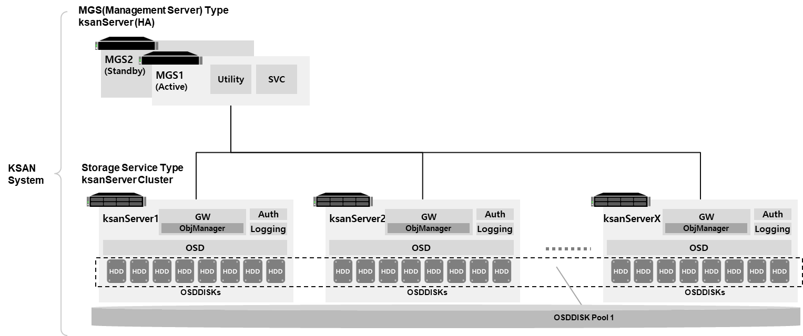
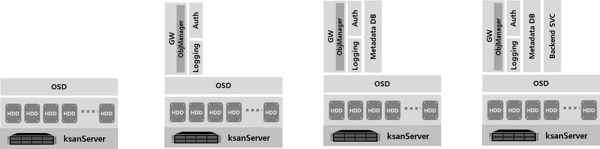

# KSAN : Software Defined Storage for Objects

## Overview

[KSAN](https://github.com/infinistor/ksan)은 대규모 오브젝트 스토리지 서비스를 안정적이며 효율적으로 제공하기 위해 설계된 소프트웨어 정의 오브젝트 스토리지 시스템입니다.

KSAN 시스템은 이중화를 고려한 Management Server(MGS) 타입의 ksanServer 집합과 스토리지 서비스의 성능 및 용량의 확장이 가능한 Storage Service 타입의 ksanServer 집합으로 구성할 수 있습니다.

Management Server(MGS)는 이중화 구성을 권장하며, KSAN 시스템의 모든 서버와 서비스를 모니터링하고 관리하는 역할을 담당합니다. MGS Type의 ksanServer 클러스터는 필요에 따라 Storage Service Type의 ksanServer 클러스터와 완전히 분리하거나 함께 사용하실 수 있습니다.

ksanServer는 구성에 따라 다양한 역할을 할 수 있도록 설계되어 있습니다.

ksanServer는 기본적으로 오브젝트 스토리지의 확장 가능한 서비스 프론트엔드 및 백엔드 저장장치의 역할을 하며, AWS S3 호환 서비스를 동시에 처리할 수 있도록 설계되어 있습니다. 또한 메타데이터를 보관하는 방식(예를 들어 MariaDB, MongoDB 등)에 따라 ksanServer 내에 메타데이터 저장소를 배치할 수 있습니다.

    

## Key Features

### 확장 가능한 오브젝트 스토리지

KSAN 시스템은 스케일-아웃 형태의 확장을 지원합니다.

관리자는 ksanServer를 KSAN 서비스의 중단없이 필요에 따라 추가할 수 있도록 설계되었습니다. 증설된 ksanServer의 OSD/OSDDISK를 기존 OSDDISK 그룹(Disk pool)에 편입하면 즉시 스토리지 풀이 확장됩니다. 또한 증설된 ksanServer의 GW는 기존 오브젝트 스토리지 서비스 풀에 즉시 참여 가능하며 서비스 대역폭을 확장하는 역할을 합니다.

  

### 업계 표준의 다양한 오브젝트 스토리지 서비스 API 지원

KSAN은 오브젝트 스토리지 서비스 시장에서 가장 널리 사용되는 오브젝트 스토리지 서비스 API와 호환성을 제공하여 기존 클라우드 기반의 어플리케이션의 수정없이 사용할 수 있게 합니다.

KSAN은 AWS S3 호환 API를 기본적으로 제공하고 개발 로드맵에 따라 Microsoft Azure API 및 Google Cloud API를 순차적으로 제공할 예정입니다.

현재 KSAN에서 지원하는 AWS S3 호환 API는 이 문서([S3 Compatible API List](http://vpn.pspace.com:3000/share/d3d24a01-5795-4398-8d90-6c7078efb227/doc/ksangw-s3-compatible-apis-YQ4FxMK0WO))를 참조해 주십시오.

현재 KSAN에서 지원하는 AZURE BLOB 호환 API는 이 문서([AZURE BLOB Compatible API List](http://vpn.pspace.com:3000/share/d3d24a01-5795-4398-8d90-6c7078efb227/doc/ksangw-blob-apis-2uUmS24H5E))를 참조해 주십시오.

현재 KSAN에서 지원하는 AZURE BLOB 호환 API는 이 문서([AZURE BLOB Compatible API List](http://vpn.pspace.com:3000/share/d3d24a01-5795-4398-8d90-6c7078efb227/doc/ksangw-blob-apis-2uUmS24H5E))를 참조해 주십시오.

ℹ️ Microsoft Azure API 및 Google Cloud API는 각각 2022년, 2023년에 단계적으로 지원할 예정입니다.

ℹ️ Microsoft Azure API는 v1.2.0부터 지원합니다. Google Cloud API는 v1.4.0부터 상호호환성을 제공할 예정입니다.

  

### 미션 크리티컬 서비스에 즉시 도입 가능한 고가용성을 지원

KSAN 시스템은 메타데이터를 관리하기 위해 MariaDB와 같은 RDBMS와 MongoDB와 같은 NoSQL DB 등으로 구성할 수 있도록 설계되었으며, 각각의 지원 대상에 따라 최적화된 방식으로 DB 서비스의 고가용성을 지원합니다.

ℹ️ v1.1.0부터 MariaDB 또는 MongoDB 클러스터를 이용해 Object 메타데이터를 관리할 수 있습니다.

  

그리고 KSAN 시스템의 오브젝트 데이터는 서로 다른 OSD의 OSDDISK에 복제본을 배치 및 저장하는 방식으로 단일 지점의 물리적인 장애에 대응하도록 설계되었습니다. 또한 ksanGW는 HAProxy 등의 서비스 로드밸런서를 이용해 오브젝트 스토리지 서비스의 가용성을 보장할 수 있습니다.

또한 KSAN 시스템은 재해 상황에 대해서도 서비스 가용성을 보장할 수 있습니다. ksanReplicationManager 모듈은 ksanGW에서 기록하는 Service Log를 기반으로 다른 지역에 구축된 KSAN 시스템들 간의 오브젝트 데이터를 실시간으로 동기화하는 기능을 제공합니다.

ℹ️ 재해 상황에 대한 서비스 고가용성 지원을 위한 ksanReplicationManager 기능은 v1.2.0 부터 지원합니다.

  

### 유연하고 효율적인 저장 자원의 관리 지원

이더넷으로 연결된 ksanServer Cluster의 백엔드 저장 자원인 OSDDISK의 그룹(Disk pool)은 모든 사용자가 동시에 사용할 수 있습니다. 특정 버켓의 오브젝트를 삭제하면 즉시 해당 백엔드 저장 자원은 반환되며, 다른 버켓의 오브젝트 저장에 즉시 활용할 수 있습니다.

또한 1+1 복제 방식으로 OSDDISK에 분산 저장된 오브젝트 데이터를 특정 시간이 지나면 자동으로 Erasure Coding으로 처리해 더 적은 백엔드 저장 자원으로 오브젝트 데이터를 보관할 수 있도록 설계되었습니다.

ℹ️ KSAN의 Erasure Coding 기능은 v1.2.0 부터 지원합니다.

  

## KSAN 시작하기

* [Quick Start Guide](http://vpn.pspace.com:3000/share/d3d24a01-5795-4398-8d90-6c7078efb227/doc/quick-start-guide-rC1ZgcsjS3)
* [KSAN CLI Usage](http://vpn.pspace.com:3000/share/d3d24a01-5795-4398-8d90-6c7078efb227/doc/ksan-cli-usage-PMTp2vuLMK)
* [KSAN S3-Compatible APIs](http://vpn.pspace.com:3000/share/d3d24a01-5795-4398-8d90-6c7078efb227/doc/ksangw-s3-compatible-apis-YQ4FxMK0WO)
* [KSAN AZURE-Compatible BLOB APIs](http://vpn.pspace.com:3000/share/d3d24a01-5795-4398-8d90-6c7078efb227/doc/ksangw-blob-apis-2uUmS24H5E)

   

---

⚠️ 이 프로젝트는 아직 상업적 제품 제작에 적합한 단계가 아닙니다. 2023년 상반기 중에 상업적 이용에 적합한 수준에 도달하는 것을 목표로 하고 있습니다.

ℹ️ 이 프로젝트를 교육 및 연구목적에 적합한 단계입니다. 교육에 활용하는 경우 연락해주시면 필요에 따라 기술지원을 제공해 드리겠습니다.

---

ℹ️ 이 프로젝트는 2021년도 정부(과학기술정보통신부)의 재원으로 정보통신기획평가원의 지원을 받아 수행된 연구임 (No.2021-0-00422)

ℹ️ This Project was supported by Institute of Information & communications Technology Planning & Evaluation (IITP) grant funded by the Korea government(MSIT) (No.2021-0-00422)

---
**Maintainers** 
PSPACE, Inc. 
ksan@pspace.co.kr 
https://pspace.com 
  
**Contributing** 
We welcome both companies and individuals to provide feedback and updates to this repository.
  
**Copyright** 
Copyright© 2021 PSPACE, Inc. All rights reserved.
  
